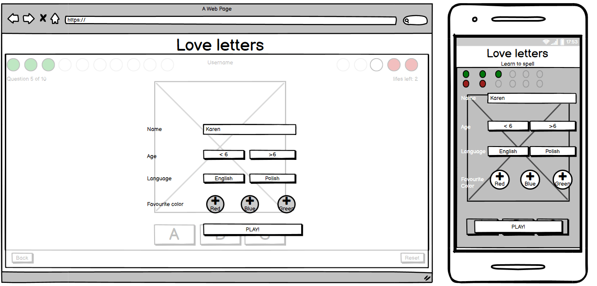
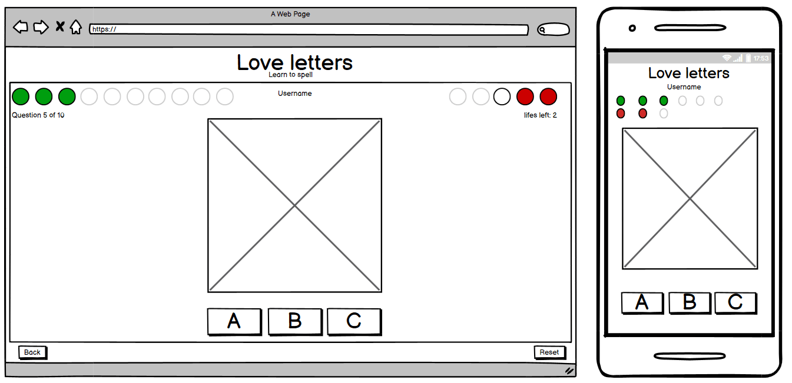
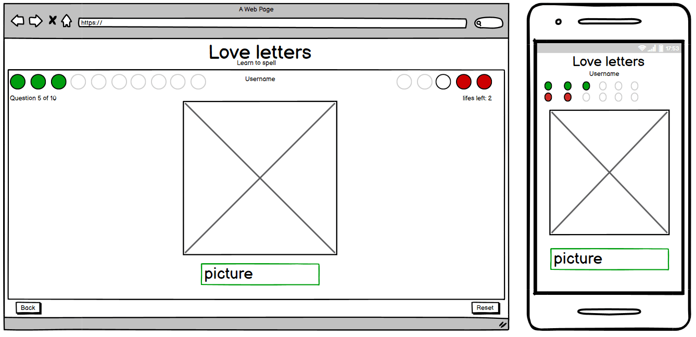

# Love letters

A simple webbased application targeted at small kids aiming at practicing spelling. To start the application a parent/care taker needs to enter initial information about the user such as name and age. The age is used to choose one of the two levels of difficulty in the game.

Love letters game is based on a simple spelling challenge. The game displays picture and asks about the name of presented item. On the easier lever targeting younger players are asked to choose the first letter of items name (by clicking with the mouse or choosing letter on keybord). Older users are asked to type while name of presented item using the keybord. The correct/wrong answers will be counted resulting in a win or loose.

## UX

### Learn spelling - game for kids

### User stories

* My son is learning to recognize letters. He's constantly asking questions about how words are spelled. He would also work at the computer like his mommy. It would make him so happy to be able to play and learn letters with help of the computer.

* We can not avoid young generations early conntacts with the computer screen. However, we have choice to make this contact valueble. I would like my chlildren to learn while they are using the computer. I expect that the application website will not allow the kid for unnecessary interaction - I don't want to reset a game for my son too often. 

* the game should be simple enough so my kid would be able to play it alone after I set it up for him.

* A game/website for my toddler should not be too conplicated. It's annoying when I can not figure out something that my 3-year old is supposed to use.

* Too many pictures on the webside could distract kids from the challenges.

### Wireframe:

* Start page

* User details form

* Easier version

* More difficult version

 

### Changes

* Index page was added for clarity. 
* Rules and About were introduced
* 

### Features

#### implemented

#### future

Love letters gives possibility to add new questions and eaven an advanced difficulty level.

1. For adding more pictures: 

* Add pictures to pictures folder and modify question array by adding new records.

2. For adding new difficulty level:

### Encountered bugs
- [x] game does not work

* Problem: There is problem with reading the value for age/difficulty. The visual representation of a checked box appear but the value is undefined. 
Reason: Script modified the style of the input-div, however the box remained unchecked. 
Solution: removing js script for controlling style of the age-input and replacing it with css styling using :checked.

- [x] game runs multiple times
* Problem: The games runs multiple times on easy level. At first attempt it runs once, than twice, four time and so on. 
Reason: The event listeners are added each time the event litener is run.
Solution: New place for event listeners in the game script.

- [x] game runs multiple times
* Problem: The games runs multiple times on medium level. 
Reason: See above.
Solution: New place for event listeners in the game script.

- [x] game runs multiple times 
* Problem: The games runs multiple times on medium level when user fails. 
Reason: While game displays game result the script continue checking the answer.
Solution: Rearange the script. Set a new function for displaying result that turns off checking the answer.

- [x] reseting game 
* Problem: The game does not resolve after game is over. The scores are resetted and old picture remains on the display.
* Reason: Error in setTimeout function. setTimeout cannot pass value to displayQuestion function.
* Solution: use othe function to restart the game.

### Deployment

### Credits
* Modals were buid based on code from w3 schools example
[How TO - CSS/JS Modal](https://www.w3schools.com/howto/howto_css_modals.asp)

* The buttons based on radio buttons were build based on w3 examples and petrabarus's  jsfiddles

[How TO - Custom Checkbox](https://jsfiddle.net/petrabarus/pPgS7/)  

[Remove Circle Button in Radio](https://jsfiddle.net/petrabarus/pPgS7/)

* Animation was created according to w3 schools instructions
[CSS Animations](https://www.w3schools.com/css/css3_animations.asp)

* Shuffling array Akshat Garg (mentor)

