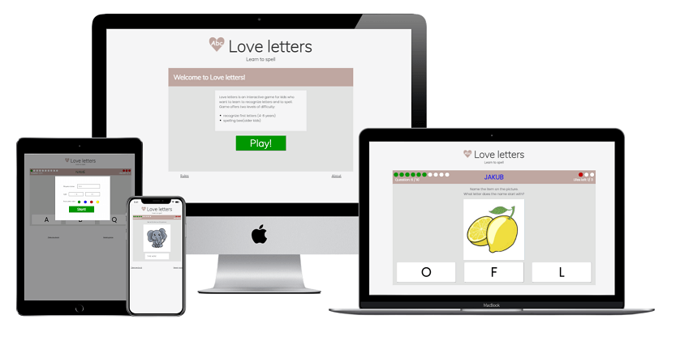

# Love letters 1.1.0

A simple webbased application targeted at small kids aiming at practicing spelling. To start the application a parent/care taker needs to enter initial information about the user such as name and age. The age is used to choose one of the two levels of difficulty in the game.

Love letters game is based on a simple spelling challenge. The game displays picture and asks about the name of presented item. On the easier lever targeting younger players are asked to choose the first letter of items name (by clicking with the mouse or choosing letter on keybord). Older users are asked to type while name of presented item using the keybord. The correct/wrong answers will be counted resulting in a win or loose.

Mockup genarated by [Techsini](https://techsini.com/multi-mockup/)

## UX

### Learn spelling - game for kids

### User stories

1. My son is learning to recognize letters. He's constantly asking questions about how words are spelled. He would also work at the computer like his mommy. It would make him so happy to be able to play and learn letters with help of the computer.

2. We can not avoid young generations early conntacts with the computer screen. However, we have choice to make this contact valueble. I would like my chlildren to learn while they are using the computer. I expect that the application website will not allow the kid for unnecessary interaction - I don't want to reset a game for my son too often. 

3. The game should be simple enough so my 5 yers old kid would be able to play it alone after I set it up for him on iPad.

4. A game/website for my kids should not be too conplicated. It's annoying when I can not figure out something that my 3-year old is supposed to use.

5. Too many pictures on the webside could distract kids from the challenges.

6. We are looking for a game we could play together so that my son can practice his letters. My doughter overly sensitive so I would like to avoid blinking object, bliping noise and so on.

### Wireframe:

* Start page

[start page wireframe](assets/images/start.png)

* User details form

[form wireframe](assets/images/form.png)

* Easier version

[easy game wireframe](assets/images/easy.png)

* More difficult version

[medium page wireframe](assets/images/medium.png) 

### Changes

* Index page was added for clarity after the page was deployed. 
* Rules and About were introduced
* Initial form was moved to front page
* The rules were udjusted (3 attempts at medium level)

### Features

#### Existing features:

- Index page

* Index page with a logo, title and and an introduction to the game and a button to start a game. 
* Modal with form collecting yser information needed to start the game opended at button click. Submitting the modal redirects to the game page passing yser information in the URL.
* Links to modals presenting rules and information about the game at the bottom of the page.

- Game page

* Game page features the same logo as the index page.
* Scores bar presenting the progress of the game, username typed in their favourite color and remaining lifes. 
* Game field contains the task description, question picture and answer box/boxes.
* Love letters game offers user two different difficulty levels.
* The task is selected according to choosen level.
* Question picture selected randomly from the question bank.
* Answear box/boxes: depending on the level there are tree answer boxes to be chosen by mouse click or a input box for typing the answer.the answer boxes are interactive. Selecting/typing an answer returns color change to red (wrong) or green (correct).
* There are three modals that can appear on the game page. They provide user with a form when restaring the game or information about correct answer or end of the game. the modals can be closed by clicking on an close button on the top of the box (x).

#### Posible features

* More questions could be easily added to the questions bank.
* Game offers possibility of creating additional advanced level with more difficult words or less attempts.
* Adding possibility to take keybord answers would for easy level would be a valuable feature.

## Testing

### Testing against user stories

The visitors of the webpage expect/want/need:

1. My son is learning to recognize letters. He's constantly asking questions about how words are spelled. He would also work at the computer like his mommy. It would make him so happy to be able to play and learn letters with help of the computer.

- Love letters was design for kids to learna and enjoy spelling. It is working on both mobile and desktop applications.

2. We can not avoid young generations early conntacts with the computer screen. However, we have choice to make this contact valueble. I would like my chlildren to learn while they are using the computer. I expect that the application website will not allow the kid for unnecessary interaction - I don't want to reset a game for my son too often. 

- The game is simple to play and agter its over one button click restarts it with the same settings. There are navigation buttons to return on the home page and reset the game but they are not highlighted to avoid unnecessary interaction by the youngest users.

3. The game should be simple enough so my 5 yers old kid would be able to play it alone after I set it up for him on iPad.

- The game has easy navigation with buttons in bright colors so that user could easy setuo a game for themselves. 

4. A game/website for my kids should not be too conplicated. It's annoying when I can not figure out something that my 3-year old is supposed to use.

- The game has easy navigation with buttons in bright colors so that user could easy setuo a game for themselves, moreover rules can be found on the main page for clarity.

5. Too many pictures on the webside could distract kids from the challenges.

- The design is simple without too many distracting elements. However, to make it fun for young users the username can be setup in players favorite color.

6. We are looking for a game we could play together so that my son doughter practice his letters. My doughter overly sensitive so I would like to avoid blinking object, bliping noise and so on.

- The game does not blink havily, it is silent and has simple design in order not to overstimulate the player. Ilustrations used in the questions are kept relatively simple.

### Validator testing

#### HTML validator [W3 HTML validator](https://validator.w3.org/)

- [x] Error in attribute tyoe and respective errors with placeholder and required attributes
- [x] h2 inside a button

#### CSS validator [The W3C CSS Validation](https://jigsaw.w3.org/)

No errors found.

#### JavaScript validator

- [] many featrures are available in ES6 

####  Google Lighthouse Tool

Google Lighthouse tools returned all scores above 95%. 

[scores for mobile version](assets/images/mobile.png)

[scores for desktop version](assets/images/desktop.png)

### Manual testing

#### Chrome DevTools

Chrome DevTools were used to test Love letters at different screen sizes and different screen orientations which helped to impreve the responsivness of the game.

#### Different browsers

Love letters was tested at different browsers.

- desktop version was tested at:
* Google Chrome Version 91.0.4472.77
* Firefox 89.0
* Microsoft Edge Version 91.0.864.41

- mobile
* Chrome at OnePlus
* Safari at Ipone SE 2020

All of the browsers showed good performance of the webpage.

### Encountered bugs
- [x] game does not work

* Problem: There is problem with reading the value for age/difficulty. The visual representation of a checked box appear but the value is undefined. 
Reason: Script modified the style of the input-div, however the box remained unchecked. 
Solution: removing js script for controlling style of the age-input and replacing it with css styling using :checked.

- [x] game runs multiple times
* Problem: The games runs multiple times on easy level. At first attempt it runs once, than twice, four time and so on. 
Reason: The event listeners are added each time the event litener is run.
Solution: New place for event listeners in the game script.

- [x] game runs multiple times
* Problem: The games runs multiple times on medium level. 
Reason: See above.
Solution: New place for event listeners in the game script.

- [x] game runs multiple times 
* Problem: The games runs multiple times on medium level when user fails. 
Reason: While game displays game result the script continue checking the answer.
Solution: Rearange the script. Set a new function for displaying result that turns off checking the answer.

- [x] reseting game 
* Problem: The game does not resolve after game is over. The scores are resetted and old picture remains on the display.
* Reason: Error in setTimeout function. setTimeout cannot pass value to displayQuestion function.
* Solution: use othe function to restart the game.

- [x] Several bugs related to typos or errors in JavaScript.

### Deployment

Love letters site was deployed to GitHub pages. The steps to deploy are as follows:

In the GitHub repository, navigate to the Settings tab
From the source section drop-down menu, select the Master Branch
Once the master branch has been selected, the page will be automatically refreshed with a detailed ribbon display to indicate the successful deployment.
(Description by Code Institue)

The live link can be found here - [Love letters](https://joannawojtasz.github.io/LoveLetters/)

The deployment of the page did not provide any errors.

### Credits
* Modals were buid based on code from w3 schools example
[How TO - CSS/JS Modal](https://www.w3schools.com/howto/howto_css_modals.asp)

* The buttons based on radio buttons were build based on w3 examples and petrabarus's  jsfiddles [How TO - Custom Checkbox](https://jsfiddle.net/petrabarus/pPgS7/) [Remove Circle Button in Radio](https://jsfiddle.net/petrabarus/pPgS7/)

* Animation was created according to w3 schools instructions
[CSS Animations](https://www.w3schools.com/css/css3_animations.asp)

* Parts of the JavaScript were wrote with kind help of Akshat Garg (mentor)

* Timouts were build based on w3 scools examples [Window setTimeout() Method](https://www.w3schools.com/jsref/met_win_settimeout.asp)

* To obtain data from URL example from sitepoint was followed [Quick Tip: Get URL Parameters with JavaScript](https://www.sitepoint.com/get-url-parameters-with-javascript/)

